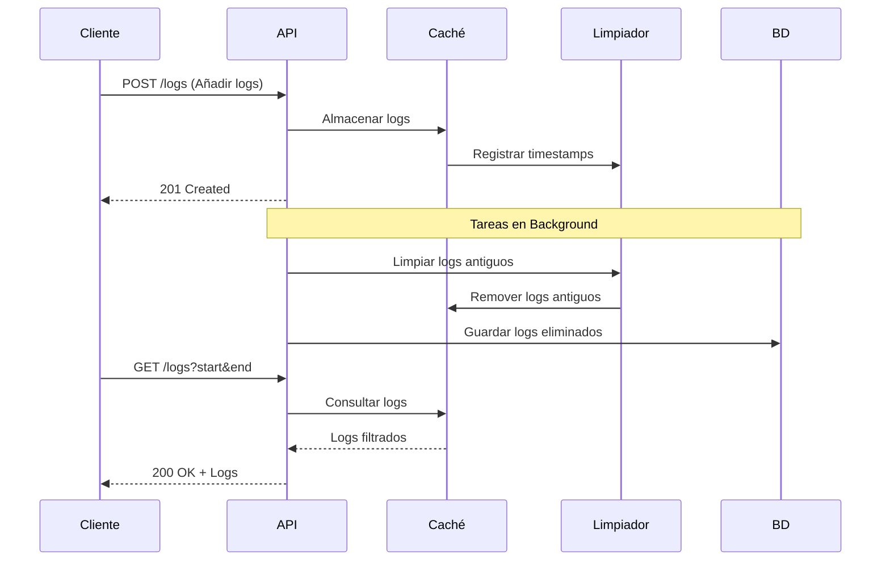

# 🪵 Log Analyzer
Log Analyzer es un sistema de gestión de logs de alto rendimiento construido con FastAPI y Python. Proporciona caché temporal, limpieza automática de logs antiguos y almacenamiento persistente.

## 🏗️ Arquitectura


## 🔧 Componentes

### API (FastAPI)
- Maneja las peticiones HTTP
- Coordina el flujo de datos
- Gestiona tareas en background

### Caché Temporal
- Almacenamiento en memoria usando SortedDict
- Organiza logs por timestamp
- Permite búsquedas eficientes

### Limpiador de Logs
- Mantiene ventana temporal configurable
- Elimina logs antiguos automáticamente
- Registra timestamps para seguimiento

### Base de Datos SQLite
- Almacenamiento persistente
- Guarda logs eliminados del caché
- Mantiene histórico completo

## 🚀 Instalación

```bash
# Clonar repositorio
git clone <url-repositorio>
cd AlgoritmiaYOptimizacionDeCodigoEnPython

# Crear entorno virtual
python -m venv venv
.\venv\Scripts\activate

# Instalar dependencias
pip install -r requirements.txt
```

## ▶️ Ejecución

```bash
# Iniciar servidor API
python main.py
```

El servidor se iniciará en `http://localhost:8000`

## 📡 Ejemplos de Uso

### Añadir Logs
```bash
curl -X POST "http://localhost:8000/logs" \
  -H "Content-Type: application/json" \
  -d '{
    "logs": [
      {
        "timestamp": "2023-04-23T10:00:00",
        "tag": "INFO",
        "message": "Log de prueba"
      }
    ]
  }'
```

### Consultar Logs por Rango
```bash
curl "http://localhost:8000/logs?start_time=2023-04-23T10:00:00&end_time=2023-04-23T10:05:00"
```

### Obtener Todos los Logs
```bash
curl "http://localhost:8000/logs/all"
```

## ⚙️ Configuración

El sistema se puede configurar mediante:
- `window_minutes`: Ventana temporal para retención de logs
- `db_path`: Ruta de la base de datos SQLite
- Puerto del servidor (por defecto 8000)

## 🔍 Características Principales

1. **Almacenamiento Eficiente**
   - Caché en memoria para acceso rápido
   - Organización temporal de logs
   - Limpieza automática

2. **API RESTful**
   - Endpoints intuitivos
   - Validación de datos
   - Documentación automática (Swagger)

3. **Persistencia**
   - Almacenamiento automático de logs antiguos
   - Base de datos SQLite
   - Transacciones seguras

4. **Rendimiento**
   - Operaciones asíncronas
   - Tareas en background
   - Búsquedas optimizadas